# MarketDash 📈

A full-stack algorithmic trading platform combining real-time market data, AI-powered analysis, and a sophisticated quantitative backtesting engine with state-of-the-art machine learning models.

> **Demo video:** 

[](https://youtu.be/Pmx8I3rYUH0?si=TGUAkVkJaEEAFV00)

---

## Overview

MarketDash is a three-service architecture:

| Service | Stack | Port |
|---|---|---|
| React frontend | Vite + Tailwind + Recharts | 5173 |
| Node.js REST API | Express + SQLite + JWT | 3001 |
| Python backtesting engine | FastAPI + pandas + PyTorch | 8000 |

---

## Features

### 📊 Dashboard & Market Intelligence
- Real-time stock, ETF and crypto prices with 30-second auto-refresh
- Proprietary **heat score algorithm** ranking assets by a weighted combination of momentum, volatility and news mentions
- Biggest gainers / losers / most-mentioned in the news — updated every 15 minutes
- Search any ticker with live autocomplete (Finnhub)
- Price alert system with toast notifications

### 📈 Interactive Charts
- 30-day price history chart per asset (Alpha Vantage)
- **Sentiment gauge** — NLP scoring of recent news headlines combined with price momentum, rendered as a TradingView-style needle gauge
- Buy / Sell / Neutral percentage distribution
- AI-generated **Trader Talk** — Claude generates a realistic live chat room feed of 20 traders discussing the asset, using actual price history and news headlines as context

### 💼 Portfolio
- Buy and sell positions with real-time P&L tracking
- Unrealized P&L, realized P&L, and total P&L across all positions
- Today's intraday move per position in dollars and percentage
- Portfolio value over time chart (one snapshot per day)
- Full transaction history with CSV export

### 🔬 Strategy Backtester
14 trading strategies with tunable parameters, an advanced risk engine, and a strategy comparison mode.

**Traditional strategies:**
- SMA Crossover
- RSI Mean Reversion
- Bollinger Band Breakout
- MACD Crossover
- Mean Reversion (Z-Score)
- Time Series Momentum
- Multi-Signal Combination
- Volatility Breakout
- Trend + Mean Reversion Hybrid
- Kalman Filter Trend
- Opening Range Breakout
- VWAP Momentum

**Machine learning strategies:**
- LightGBM ML Signal
- LSTM Neural Network
- Transformer (Self-Attention)
- PatchTST
- Ensemble (Transformer + LightGBM)

**Backtesting engine features:**
- ATR-based trailing stop loss
- Dynamic position sizing (volatility-adjusted)
- Drawdown circuit breaker
- Minimum holding period enforcement
- Commission modeling (0.1%)
- Full equity curve vs buy-and-hold benchmark
- Sharpe ratio, max drawdown, win rate, annualized return, volatility
- Complete trade log with entry/exit/reason
- Feature importance visualization (LightGBM)
- Strategy comparison mode — run multiple strategies simultaneously and compare overlaid equity curves and metrics

### 🔐 Auth & Settings
- JWT authentication with bcrypt password hashing
- SQLite database (users, positions, transactions, portfolio snapshots)
- Change password, delete account, export transactions as CSV, configure refresh interval

---

## Machine Learning

All ML strategies use **walk-forward validation** — the model only ever predicts on data it has never seen, in the same way it would work in live trading. No lookahead bias.

### LightGBM
Gradient boosting classifier trained on 21 technical indicators (RSI, MACD, Bollinger Bands, ATR, OBV, returns, SMA distances, volume ratios). Walk-forward validation with quarterly retraining on the target ticker. Fast (~40s), interpretable via feature importance.

### LSTM Neural Network
2-layer LSTM with attention mechanism. Trained on **15 diverse tickers simultaneously** (~15,000 samples) to learn universal market patterns rather than ticker-specific history. The target ticker is excluded from training via correlation check (>0.999 threshold) to prevent data leakage. Captures temporal dependencies — momentum, trend exhaustion, regime transitions — that LightGBM cannot detect.

### Transformer
Self-attention encoder trained on the same 15-ticker universe. Every timestep in the 20-day sequence attends to every other simultaneously with zero information decay — unlike LSTM which degrades information over long sequences. State-of-the-art sequence architecture.

**Benchmark results (5-year backtest):**

| Ticker | Model | Sharpe | Win Rate | Return | Buy & Hold |
|---|---|---|---|---|---|
| MS | Transformer | 2.054 | 71.4% | +451% | +171% |
| MS | LSTM | 1.526 | 67.3% | +299% | +170% |
| MS | LightGBM | 1.242 | 60.9% | +128% | +171% |
| JPM | Transformer | 1.511 | 70.5% | +208% | +131% |
| NVDA | LightGBM | 1.129 | 57.1% | +263% | +1248.5% |
| AAPL | Transformer | 1.183 | 68.4% | +170% | +117% |

*NVDA buy&hold reflects an exceptional 5-year bull-run driven by the AI boom - not representative of typical market conditions*

*Transformer excels on macro-driven trending stocks. LightGBM wins on high-volatility momentum names. No single model wins everywhere — regime-dependent performance.*

### PatchTST
Transformer variant that groups consecutive days into patches before self-attention. With seq_len=20 and patch_size=3, produces 7 richer tokens instead of 20 individual day tokens — preserving local temporal context within each patch.

### Ensemble (Transformer + LightGBM)
Only signals when both models independently agree on direction. Fewer trades, highest win rates, lowest drawdowns. The most conservative and deployable strategy.

---

## Architecture

```
┌─────────────────────────────────────────────────┐
│               React Frontend (Vite)              │
│  Dashboard │ Watchlist │ Portfolio │ Backtester  │
│                    Port 5173                     │
└──────────────────────┬──────────────────────────┘
                       │ HTTP
          ┌────────────┴────────────┐
          │                         │
┌─────────▼──────────┐   ┌─────────▼──────────────┐
│  Node.js API       │   │  Python Backtesting     │
│  Express + SQLite  │   │  FastAPI + pandas       │
│  Port 3001         │   │  + PyTorch              │
│                    │   │  Port 8000              │
│  - Auth (JWT)      │   │                         │
│  - Portfolio CRUD  │   │  - 14+ strategies       │
│  - Live prices     │   │  - ML models            │
│  - News & charts   │   │  - Backtest engine      │
│  - Heat scores     │   │  - Feature importance   │
│  - AI generation   │   │  - Walk-forward valid.  │
└────────────────────┘   └─────────────────────────┘
         │                          │
    Finnhub API              yfinance (free,
    Alpha Vantage            no API key)
    Anthropic API
```

---

## Getting Started

### Prerequisites
- Node.js 18+
- Python 3.10+
- API keys for Finnhub, Alpha Vantage and Anthropic

### Installation

**1. Clone the repo:**
```bash
git clone https://github.com/perdikeas/market-app.git
cd market-app
```

**2. Install frontend dependencies:**
```bash
npm install
```

**3. Install backend dependencies:**
```bash
cd server && npm install && cd ..
```

**4. Install Python dependencies:**
```bash
cd backtest-service
pip install fastapi uvicorn pandas yfinance lightgbm torch scikit-learn statsmodels python-dotenv
```

**5. Create `server/.env`:**
```
VITE_FINNHUB_API_KEY=your_finnhub_key
ALPHA_VANTAGE_KEY=your_alphavantage_key
ANTHROPIC_API_KEY=your_anthropic_key
JWT_SECRET=your_jwt_secret
```

**6. Create `.env` in the project root:**
```
VITE_API_URL=http://localhost:3001
VITE_BACKTEST_URL=http://localhost:8000
```

### Running locally

You need three terminals running simultaneously:

```bash
# Terminal 1 — Node.js backend
cd server && node server.js

# Terminal 2 — React frontend
npm run dev

# Terminal 3 — Python backtesting service
cd backtest-service && uvicorn main:app --reload --port 8000
```

Open [http://localhost:5173](http://localhost:5173)

---

## Screenshots

Dashboard
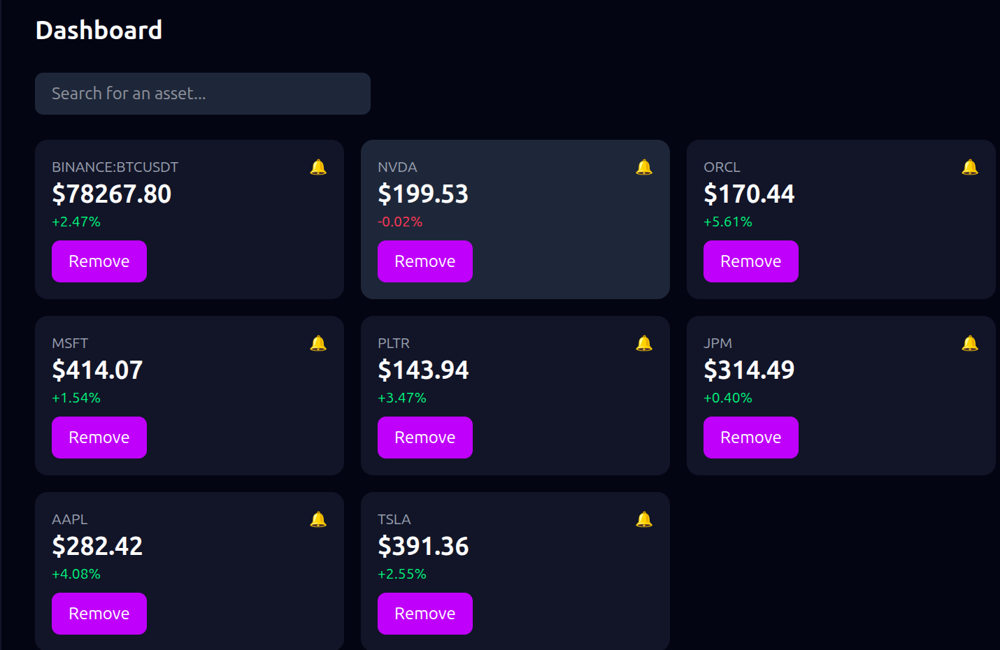

Asset Card
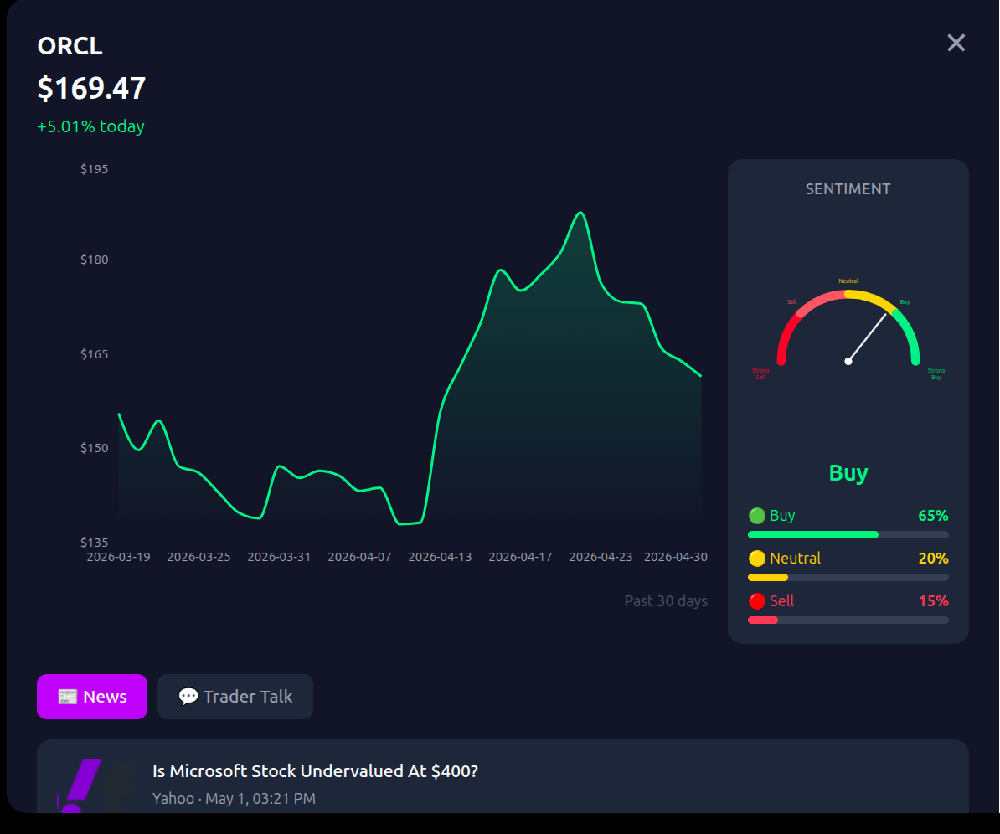

Strategy Backtester
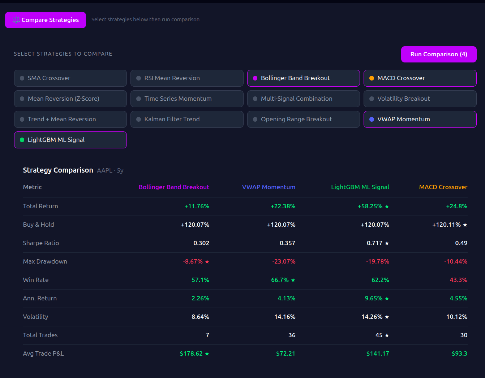

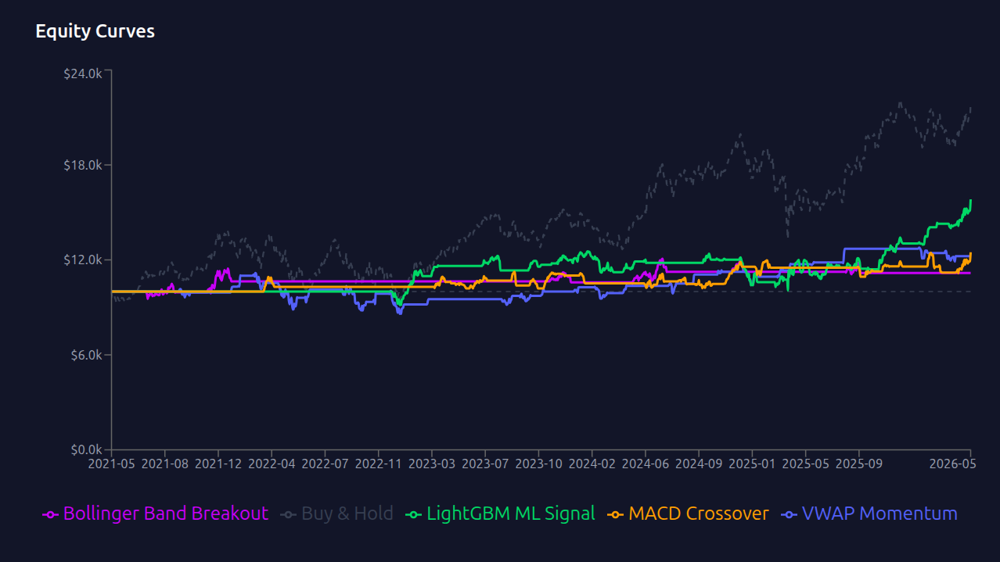

Machine Learning Models

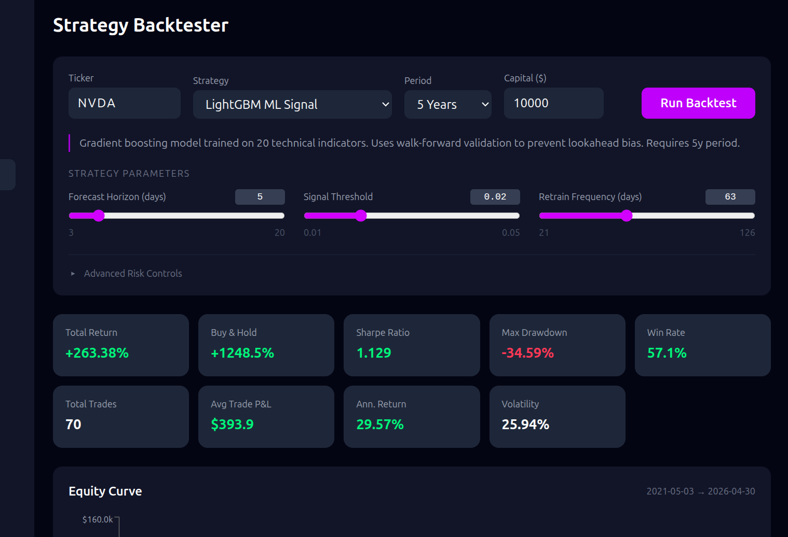

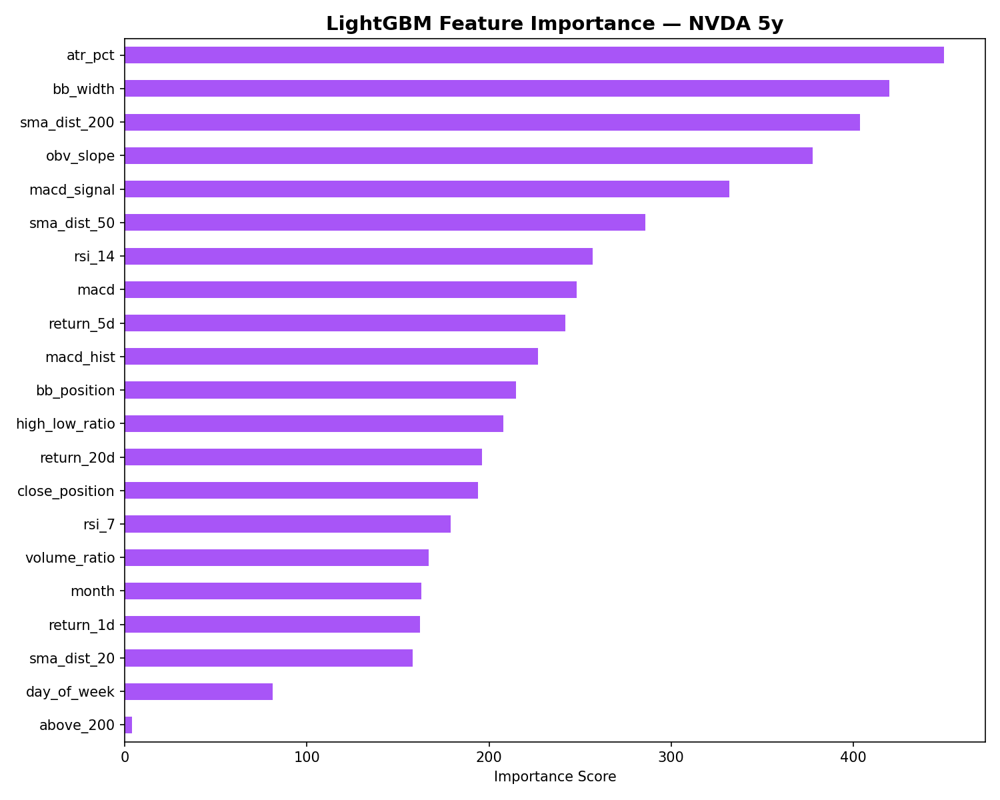

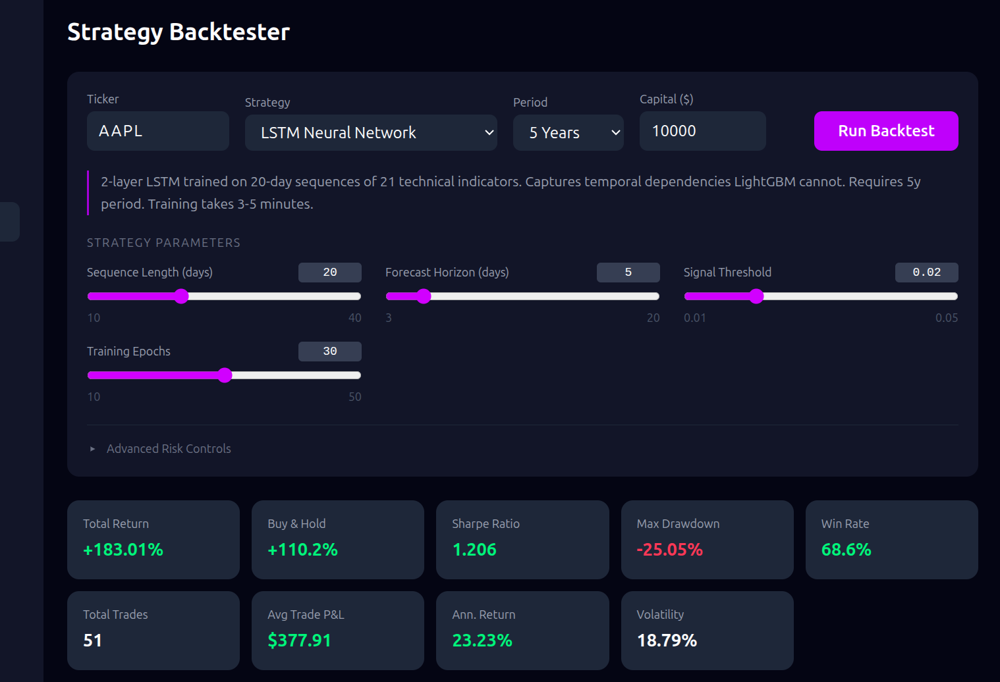

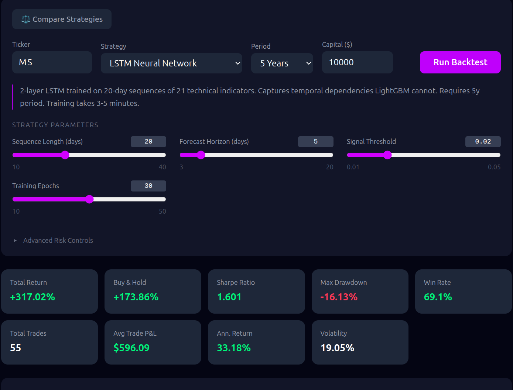

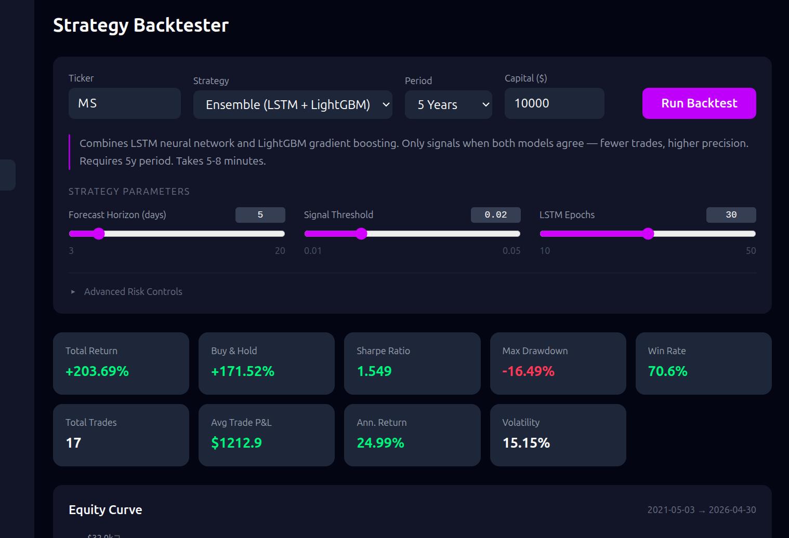

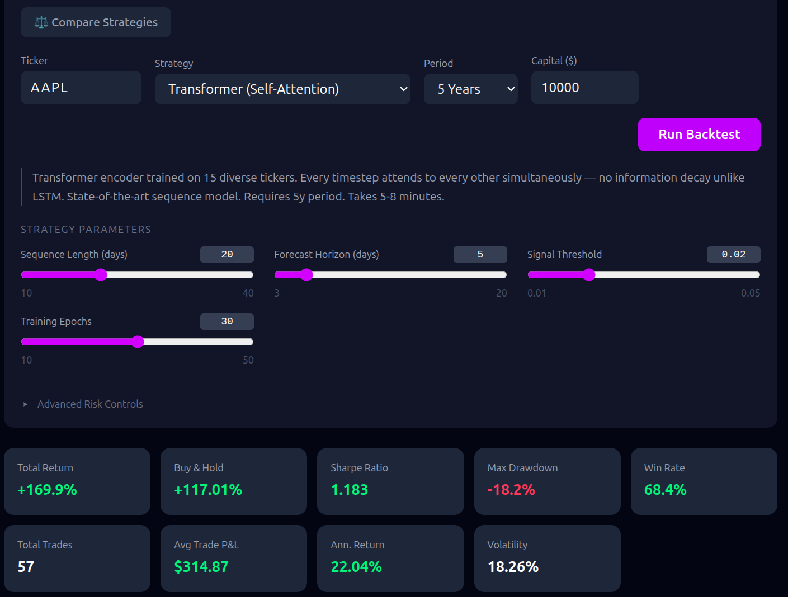

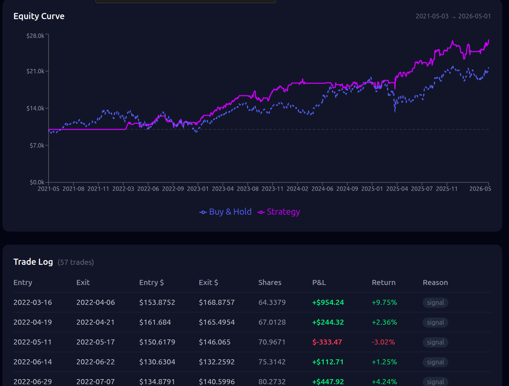

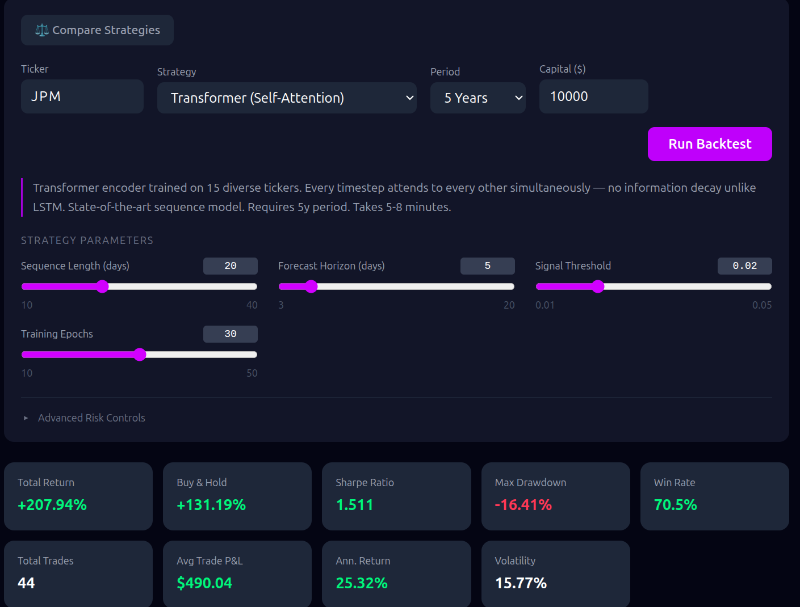

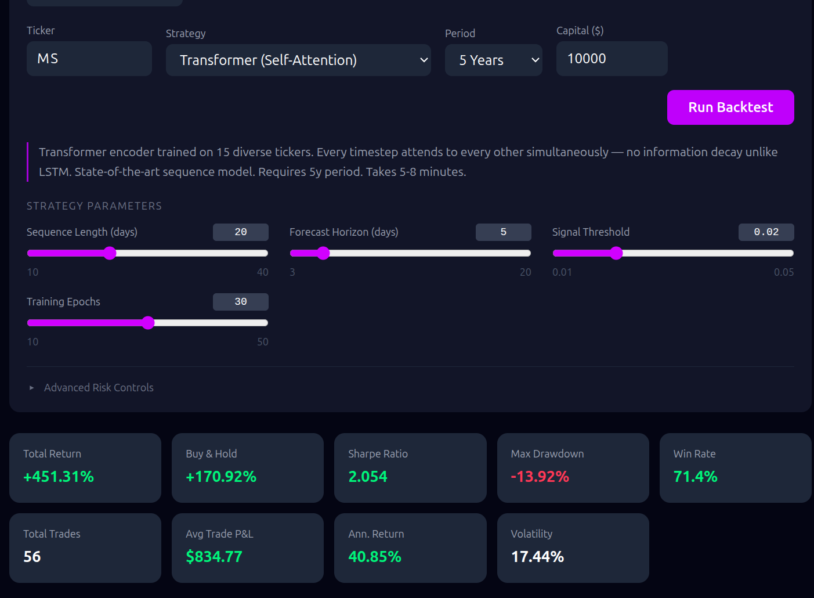

---

## License
MIT